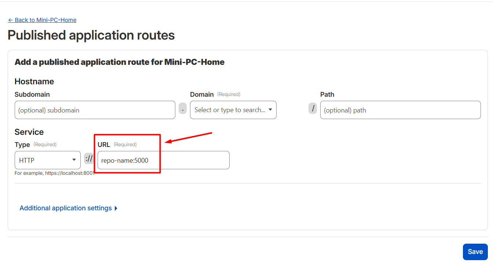

# Home Server - Mini PC Ubuntu (Docker/Portainer)

Este repositório documenta a configuração de um servidor doméstico utilizando Docker para deploy automatizado e gerenciamento via interface web.

## 🛠️ Tecnologias Utilizadas

* **SO:** Ubuntu
* **Orquestração:** Portainer (Interface Web)
* **Automação CI/CD:** GitHub Actions + Watchtower
* **Database:** MariaDB + Adminer (Gerenciador Web)

---

## 1. Configuração Inicial da Infraestrutura

### Portainer

Interface gráfica para gerenciar todos os containers.

```cmd
docker volume create portainer_data
```
```cmd
docker run -d -p 8000:8000 -p 9443:9443 --name portainer --restart=always -v /var/run/docker.sock:/var/run/docker.sock -v portainer_data:/data portainer/portainer-ce:latest
```

* **Acesso:** `https://localhost:9443`


### Watchtower

Agente que automatiza o deploy. Ele verifica se há novas imagens no Docker Hub a cada 30 segundos.
```cmd
docker run -d --name watchtower --restart always -v /var/run/docker.sock:/var/run/docker.sock containrrr/watchtower --interval 30 --cleanup
```

---

## 2. Fluxo de Deploy Automático (CI/CD)

1. **GitHub Actions:** Ao fazer `push` na branch `main`, o GitHub compila a imagem Docker.
2. **Docker Hub:** A imagem é enviada para o repositório.
3. **Watchtower:** Detecta a mudança no Docker Hub, faz o download da imagem nova e reinicia o container no Mini PC.

### Configuração do Workflow (`.github/workflows/deploy.yml`), exemplo na pasta apps

O arquivo utiliza os segredos `DOCKERHUB_USERNAME` e `DOCKERHUB_TOKEN` configurados no GitHub.

---

## 3. Stacks do Portainer

As aplicações são gerenciadas como **Stacks** dentro do painel do Portainer.


### Stack: Cloudflare Tunnel (`cloudflare-tunnel`)

Cria tunel na Cloudflare e aponta para o servidor

Na Cloudflare -> Zero Trust -> Networks -> Overview
Criar Tunel, Connectors e Routes (aba Hostname routes)



```yaml
version: '3.8'

services:
  tunnel:
    image: cloudflare/cloudflared:latest
    container_name: cloudflare-tunnel
    restart: always
    command: tunnel run --token SEU_TOKEN_AQUI # token no Cloudflare Tunnels
    networks:
      - apps-network

networks:
  apps-network:
    external: true
```

### Stack: Banco de Dados (`db-server`)

Contém o MariaDB e o Adminer para gerenciar bancos de dados via navegador na porta `8081`.
```yaml
version: '3.8'

services:
  mariadb:
    image: mariadb:latest
    container_name: mariadb-server
    command: --default-authentication-plugin=mysql_native_password
    restart: always
    environment:
      - MARIADB_ROOT_PASSWORD=sua_senha_mestra
    ports:
      - "3306:3306"
    networks:
      - apps-network
    volumes:
      - mariadb_data:/var/lib/mysql

  adminer:
    image: adminer:latest
    restart: always
    networks:
      - apps-network
    ports:
      - "8081:8080"

networks:
  apps-network:
    external: true

volumes:
  mariadb_data:
```

### Stack: Observabilidade (`observability`)

Stack com Prometheus e Grafana, utilizados para monitorar as aplicações Python

Necessário criar arquivos no server:

`/home/server/observability/prometheus.yml`
```yaml
global:
  scrape_interval: 15s

scrape_configs:
  - job_name: 'flask-heroku'
    metrics_path: '/metrics'
    scheme: 'https'
    static_configs:
      - targets: ['url-da-aplicação']
```

`/home/server/observability/promtail-config.yml`
```yaml
server:
  http_listen_port: 9080
  grpc_listen_port: 0

positions:
  filename: /tmp/positions.yaml

clients:
  - url: http://loki:3100/loki/api/v1/push

scrape_configs:
  - job_name: docker_logs
    docker_sd_configs:
      - host: unix:///var/run/docker.sock
        refresh_interval: 5s
    relabel_configs:
      - source_labels: ['__meta_docker_container_name']
        regex: '/(.*)'
        target_label: 'container'
```

Stack no Portainer
```yaml
version: '3.8'

services:
  prometheus:
    image: prom/prometheus:latest
    container_name: prometheus
    restart: always
    ports:
      - "9090:9090"
    volumes:
      - /home/server/observability/prometheus.yml:/etc/prometheus/prometheus.yml
      - prometheus_data:/prometheus
    command:
      - '--config.file=/etc/prometheus/prometheus.yml'
      - '--storage.tsdb.path=/prometheus'
    networks:
      - apps-network

  grafana:
    image: grafana/grafana:latest
    container_name: grafana
    restart: always
    ports:
      - "3000:3000"
    volumes:
      - grafana_data:/var/lib/grafana
    networks:
      - apps-network
  
  loki:
    image: grafana/loki:latest
    container_name: loki
    ports:
      - "3100:3100"
    command: -config.file=/etc/loki/local-config.yaml
    networks:
      - apps-network

  promtail:
    image: grafana/promtail:latest
    container_name: promtail
    volumes:
      - /var/run/docker.sock:/var/run/docker.sock
      - /var/log:/var/log
      - /var/lib/docker/containers:/var/lib/docker/containers:ro
      - /home/server/observability/promtail-config.yml:/etc/promtail/config.yml
    command: -config.file=/etc/promtail/config.yml
    networks:
      - apps-network

networks:
  apps-network:
    external: true

volumes:
  prometheus_data:
  grafana_data:
```

### Stack: App Flask (`flask-app`)

Configuração para rodar a aplicação Python puxando a imagem do Docker Hub.

```yaml
version: '3.8'

services:
  flask-app:
    image: docker-hub-user/repo-name
    container_name: repo-name
    ports:
      - "5000:5000"
    restart: always
    environment:
      - PYTHONUNBUFFERED=1
      - DATABASE_URI=${STACK_DATABASE_URL}
      - USER_ADM=${STACK_USER_ADM}
      - USER_ADM_PASSWORD=${STACK_ADM_PASSWORD}
    networks:
      - apps-network

networks:
  apps-network:
    external: true
```
---

## 4. Comandos Úteis no Terminal

* **Ver Logs do Watchtower:** `docker logs -f watchtower`
* **Listar Containers:** `docker ps`
* **Liberar porta no Firewall:** `sudo ufw allow 9443/tcp`
